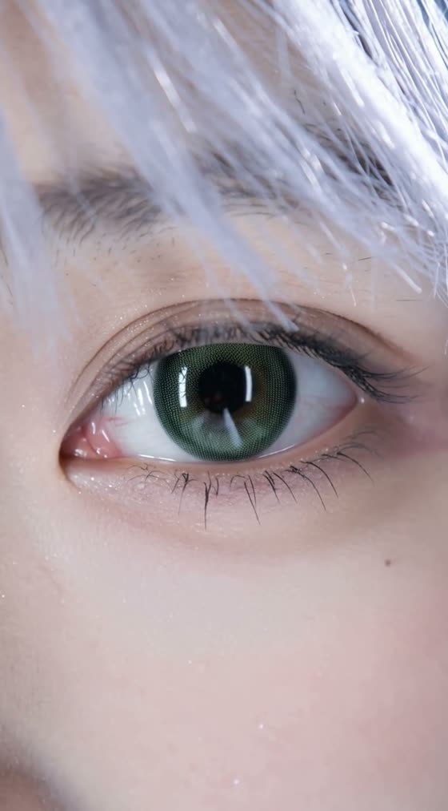
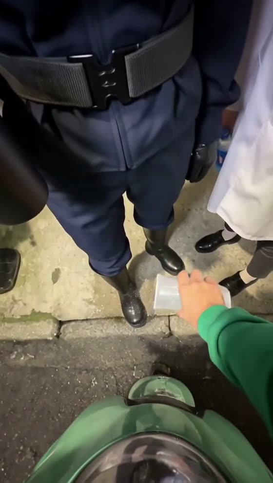
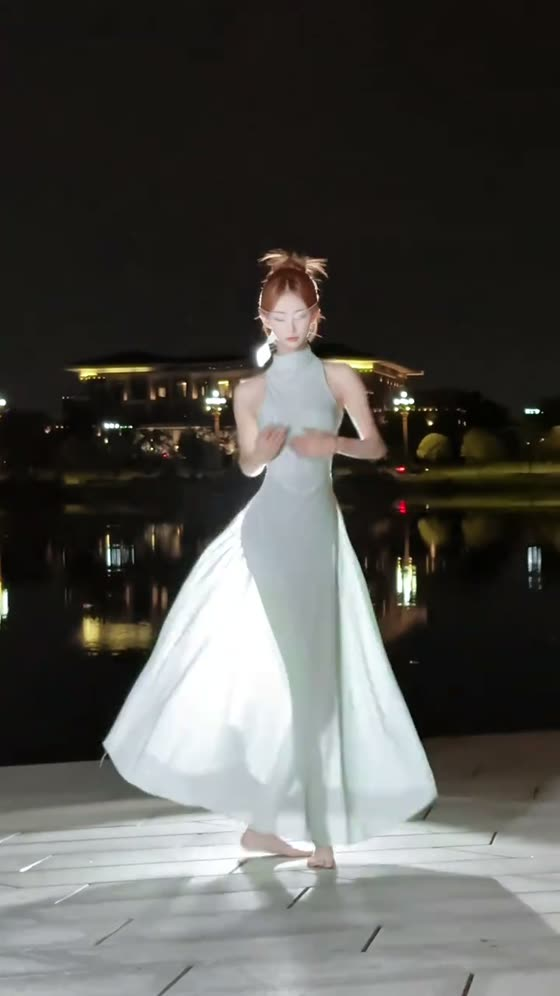
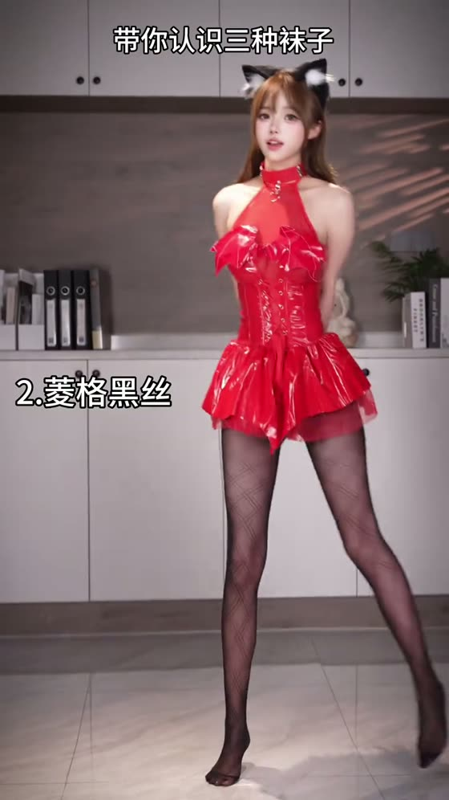

<div align="center">


# 🎬 H3 Prompt Journal

**MiniMax H3 视频/舞蹈提示词案例日记 —— 18 篇真实反推与实测，每篇附可直接粘贴的完整提示词。**

[](./case-studies)
[](https://github.com/MiniMax-AI/MiniMax-H3)
[](https://x.com/LoveUolanda/articles)

</div>

---

## 这是什么

H3 提示词工程的难点不在调参数，而在**教会模型一种关于"转场与连续性"的思维方式**。

大多数公开 H3 提示词只描述"每个镜头里该出现什么"，所以生成出来是支离破碎的片段；能跑通的提示词描述的是**镜头必须遵循的连续物理逻辑**——人物从不消失、动作跨段续接、切点吸附在音乐事件上。本仓库把每一次跑通的过程都记录下来：真实尝试 → 踩过的坑 → 突破口 → 最终可用的提示词。

> 🎬 所有案例均由这些提示词实际生成，成片演示统一收录在 [X 文章页 @LoveUolanda](https://x.com/LoveUolanda/articles)。

## 每篇案例的结构

```
case-studies/YYYY-MM-short-name/
├── README.md      <- 背景、问题、突破口、可复用的经验
└── prompt.md      <- 完整最终提示词，可直接粘贴进 H3
```

## 创作思路：音乐先行，动作跟随

本仓库一半以上的创作都是**从一首现有的歌出发**：先拿到音乐 → 切出 8–15 秒的分段 → 用 onset 检测建立节拍/卡点网格 → 让每一段编舞、转场、换装、运镜全部吸附在这条时间轴上。**音乐时间轴是 H3 稳定性的根基**——一条精确的时间码，同时驱动人物动作峰值与摄影机响应峰值（1:1 同步），H3 才不会漂。

音频切割工具：**[LoveRain1997/audio-lyric-splitter](https://github.com/LoveRain1997/audio-lyric-splitter)** —— 按 SRT 歌词把整首歌切成 H3 可用的分段音频（本仓库《10月7日》《终将重逢》等分段项目即由此流程产出）。

**没有现成音乐怎么办**：必须先让 AI 写出一段**详细的 BGM 提示词**（曲风/速度/乐器/段落/重音位置，越具体越好），把它集成进视频提示词里，并**同时写明"动作由这段 BGM 驱动"**——BGM 里的重音就是动作的峰值，BGM 的乐句就是分段边界。没有时间轴（无论来自真实音频还是文字化 BGM 网格），H3 的动作与运镜都会失去锚点而变得不稳定。

## 快速上手（三件套用法）

1. **复制 `prompt.md` 全文**粘贴到 H3（每段提示词都是自包含的，不依赖上下文）；
2. **上传锚定图**：图 1 锁外貌+服装（提示词里对图 1 零外貌描写），图 2 按需锁脸/背/多视角；
3. **附 `audio1`**（舞蹈/卡点类）：切点、抖腿、换装全部吸附在音频 onset 网格上；没有音频就集成 AI 生成的 BGM 提示词并让动作跟随它。

核心纪律速览：**音乐时间轴驱动一切 · 每段自包含 · 图 1 零外貌 · 全局规则拼进每一段（禁止规则段压底） · 卡点=onset · 分段间局部特写+动作续接 · 转场写成"动作钩子+切点原因+下段续动"**。

---

## 🧭 案例导航

### 2026-08 · 基础篇：运镜、结构与多主体

| 预览 | 案例 | 简介 |
|:---:|---|---|
|  | [004 · Furina Windsurfing Fashion MV](./case-studies/2026-08-furina-windsurfing-fashion-mv/) | 分层参考架构 + 文本驱动高潮：角色主视觉/三视图装备/分段运镜指南多图分工。🎬 [成片](./case-studies/2026-08-furina-windsurfing-fashion-mv/result-video.mp4) · [运镜指南图](./case-studies/2026-08-furina-windsurfing-fashion-mv/picture-3-segment1-cinematography-guide.png) |
|  | [006 · Sticker Character Kitchen Comedy](./case-studies/2026-08-sticker-character-kitchen-comedy/) | 贴纸角色混入真实厨房的混搭媒介喜剧。[角色贴纸图](./case-studies/2026-08-sticker-character-kitchen-comedy/picture-1-sticker-character.png) |
|  | [007 · Cinematic Character Reveal (Two-Part)](./case-studies/2026-08-cinematic-character-reveal-two-part/) | 两段式电影感角色揭示，BGM 跨段连续不断。🎬 [动作参考](./case-studies/2026-08-cinematic-character-reveal-two-part/reference-motion-sample.mp4) · [姿态库](./case-studies/2026-08-cinematic-character-reveal-two-part/picture-1-pose-library.png) |
|  | [008 · First-Person Finger-Controlled Dance](./case-studies/2026-08-first-person-finger-controlled-dance/) | 单图输入实现第一人称"手指操控"舞蹈。🎬 [参考舞步](./case-studies/2026-08-first-person-finger-controlled-dance/reference-dance-demo.mp4) |
| — | [001 · Three-Person Occlusion-Linked Orbital Long Take](./case-studies/2026-08-three-person-orbital-long-take/) | 三人遮挡联动的环绕长镜头：谁被挡住、谁先出列，全部写进物理逻辑。🎬 成片见 [X 文章页](https://x.com/LoveUolanda/articles) |
| — | [002 · Asymmetric Speed-Ratio Duo Choreography](./case-studies/2026-08-dual-subject-speed-contrast/) | 双人不对称速度比编舞：一快一慢同框共舞的节奏控制。🎬 成片见 [X 文章页](https://x.com/LoveUolanda/articles) |
| — | [003 · Micro-Cam Anchor-Flow Flight](./case-studies/2026-08-single-subject-three-pose/) | 单人三姿态微运镜：锚点流动式贴身飞行机位。🎬 成片见 [X 文章页](https://x.com/LoveUolanda/articles) |
| — | [005 · Water Obstacle Variety Show](./case-studies/2026-08-water-obstacle-variety-show/) | 综艺式水上障碍闯关：节拍锚定的即兴表演。🎬 成片见 [X 文章页](https://x.com/LoveUolanda/articles) |

### 2026-09 · 进阶篇：卡点、换装与连续舞蹈

| 预览 | 案例 | 简介 |
|:---:|---|---|
|  | [009 · Three-Person Prank, Freeze Gag + Cos Swap](./case-studies/2026-09-three-person-prank-freeze-gag-cos-swap/) | 反推实战：三人恶作剧定格笑点 + 仅换皮肤的 Cos 换装。🎬 [成片](./case-studies/2026-09-three-person-prank-freeze-gag-cos-swap/result-video.mp4) |
|  | [010 · Snap-Lock Editorial Reveal](./case-studies/2026-09-snap-lock-editorial-reveal/) | 音频吸附式 SNAP-LOCK 时尚揭示：两态相机 + 全程零外貌文本。🎬 [参考视频](./case-studies/2026-09-snap-lock-editorial-reveal/reference-video.mp4) |
| — | [011 · Song-Style Classical Dance (Six Segments)](./case-studies/2026-09-song-style-classical-dance-six-segment/) | 六段歌曲式身韵水袖舞：手递手英雄姿势阶梯 + 音乐不重启。🎬 成片见 [X 文章页](https://x.com/LoveUolanda/articles) |
| — | [012 · Editorial Lamp-Rhythm Fashion A/B](./case-studies/2026-09-editorial-lamp-rhythm-fashion-ab/) | 灯光节奏时尚片 A/B：暗奢甩裙 vs 甜美折脚跳，音乐驱动灯光切换。🎬 成片见 [X 文章页](https://x.com/LoveUolanda/articles) |
| — | [013 · Action-Chain Sock Fan Comedy](./case-studies/2026-09-action-chain-sock-fan-comedy/) | 25 状态物理状态机：脱袜-闻袜-扔镜头-弹回-光脚扇子舞的喜剧动作链。🎬 成片见 [X 文章页](https://x.com/LoveUolanda/articles) |
| — | [014 · Purple-Veil Pavilion Dance (Seven Segments)](./case-studies/2026-09-purple-veil-dance-seven-segment/) | 七段紫纱亭舞：驱动轮换编舞 + 细节切转场链 + 紫底暖键打光 + 永久面纱锁。🎬 成片见 [X 文章页](https://x.com/LoveUolanda/articles) |

### 2026-10 · 大成篇：多段长舞与转场取证

| 预览 | 案例 | 简介 |
|:---:|---|---|
|  | [016 · Waterfront Solo Dance (Two Segments)](./case-studies/2026-10-waterfront-solo-dance-two-segment/) | 水岸白裙独舞：低阈值切镜检测(≤0.08)逐帧取证单镜头真伪 + 小节吸附切分 + 链记法动作续接。🎬 成片见 [X 文章页](https://x.com/LoveUolanda/articles) |
|  | [017 · Sock Showcase, Right-Entry Three-Shot](./case-studies/2026-10-sock-showcase-right-entry-three-shot/) | 三镜袜子展示：每个服装状态=独立镜头，画右一大步跨进入画、首帧已穿新装，跳切痕迹可见是特征。逐帧转场取证实录。🎬 成片见 [X 文章页](https://x.com/LoveUolanda/articles) |
|  | [018 · Leg-Lift Contact-Cut Stocking, Six Looks](./case-studies/2026-10-leg-lift-contact-cut-stocking-six-look/) | 抬腿触地即切袜·六形态：永久支撑腿 + 单一活动腿，"脚触地"这一物理事件=剪辑触发器（CONTACT=CUT）。AnimateDiff 渐变升级为利落硬切。🎬 成片见 [X 文章页](https://x.com/LoveUolanda/articles) |
| — | [015 · Xiashan Veiled Solo (Twelve Segments)](./case-studies/2026-10-xiashan-veiled-solo-twelve-segment/) | 十二段面纱独舞：双图分权（图1服装/图2脸+背+纱）+ 链记法编舞 + 切点原因转场 + 醉酒式运镜（只有相机醉，人物永不醉）。🎬 成片见 [X 文章页](https://x.com/LoveUolanda/articles) |
|  | [019 · Identity-Only Half-Body Dance (Six Segments)](./case-studies/2026-10-identity-only-half-body-dance-six-segment/) | Identity-only 双图分权：图1只锁脸、图2只锁全身外观+环境，"图1半身像感"降级为纯镜头语言，开场零姿势继承（六段都从舞谱第一拍起跳）。111 BPM 六段连续可爱舞蹈，Motion Cut 全部切在未完成动作中间，Hero Action 专属镜头。🎬 成片见 [X 文章页](https://x.com/LoveUolanda/articles) |

### 摄影机语言工具箱 · 双系统标准

| 封面 | 标准库 | 简介 |
|:---:|---|---|
|  | [System A · Physical Camera Position Library](./case-studies/2026-10-physical-camera-position-library/) | **机位视角系统（摄影机在哪里）**：25 类视角物理定义块全文（贴地仰视/虫眼/正上方90°/荷兰角/贴身广角/防简化锁/8要素结构）。核心原则：不要命名效果（`low angle`），要定义产生效果的现实条件——机位一旦是"场景里的一件实物"，就无法被 H3 平均掉。 |
|  | [System B · Camera Movement Discipline Library](./case-studies/2026-10-camera-movement-discipline-library/) | **动态运镜系统（摄影机怎么动、为什么动）**：E 章十条实测运镜纪律 + 物理运镜十法则（POSITION/NO DEGREE/SUBJECT-TRIGGER…）+ 十三词物理词库 + 运镜块五件套 + 反目录。核心纪律："动作负责舞蹈，摄影机负责观看"——每段一个主运镜行为，镜头只为重大空间变化而动。 |
|  | [Advanced Camera Movement Combinations](./case-studies/2026-10-advanced-camera-combinations/) | **物理运镜组合库（NO DEGREE VERSION）**：14 条 SEGMENT RULES + 13 词词库 + 10 组即用运镜组合（前随→侧移→越肩→回正 / 推进→遮镜→暗侧移→揭示 / 贴地滑移→起身 / Hero Lock→微推→触发响应…）。彻底取消度数语言：`ARC 40°` 淘汰，改为 START POSITION → PHYSICAL PATH → SUBJECT TRIGGER → END POSITION → FINAL FRAMING。 |
|  | [Dance Motion Chain Library · 舞蹈动链 H3 库](./case-studies/2026-10-dance-motion-chain-library/) | **动作链标准件总库（Rev.1.0 全文镜像）**：A 宅舞 23 链 / B 抖舞 / C 古风 49 链 / D 多人 12 纪律 / E 运镜纪律 / G Hero 库 / H 13 支成品范本 / I 视角库 / J 写真 9 范本 / 拼舞模板——每条链带入态/出态与十要素描述，积木式拼舞；本仓库只读副本，正本在本地 git。 |
|  | [020 · H3 Motion Transfer — Subject-First Reconstruction](./case-studies/2026-10-h3-motion-transfer/) | **动作迁移（图1人物×目标视频动作×音频时序）**：三参考严格分权（图1=人+世界，视频1首帧=镜头几何，视频1正文=动作机制，音频1=时序权威），SUBJECT-FIRST 不可逆初始化顺序 + 八项 FINAL VALIDATION 自检。⚠️ 硬约束：**单次迁移最长 8–9 秒**，长舞按乐句拆段。附案例成片与 ComfyUI 工作流要点。🎬 [成片](./case-studies/2026-10-h3-motion-transfer/result-video.mp4) |


---

## 反推工作流（本仓库案例的生产方式）

每个 2026-09 之后的案例都经过同一套双 skill 流水线：

1. **probe**：ffmpeg 提取时长/帧率/音频波形，onset 检测输出卡点网格；
2. **五遍逻辑通读 + 低阈值切镜检测**（scene 阈值 0.27 探不到的转场，≤0.08 现形）；
3. **全帧率逐帧核对**：确认每个切点真伪、每个服装状态边界；
4. **复述确认** → 产出 H3 提示词 → 回测 → 收入日记。

配套工具：[`video-to-h3-prompt`](https://github.com/LoveRain1997/video-to-h3-prompt)（可复用的 H3 反推 skill）· 上游规范：[`h3-prompt-writing`](https://github.com/MiniMax-AI/MiniMax-H3/tree/main/skills/h3-prompt-writing)

## License

MIT — see [LICENSE](./LICENSE).
