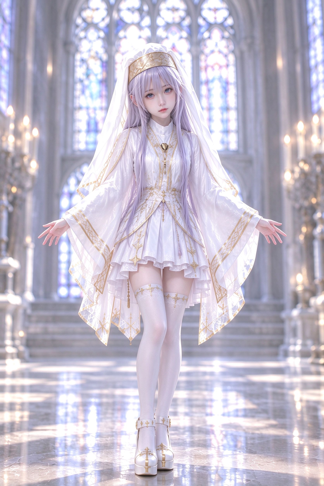

# 019 · Identity-Only Half-Body Portrait Dance, Six Segments (111 BPM)

- **Date:** 2026-10
- **Format:** six self-contained segments, 111 BPM (beat 0.5405s / bar 2.1622s), total ≈ 73.4s
- **Input contract:** `<Picture 1>` = face crop · `<Picture 2>` = full-body appearance + environment · `<Audio 1>` = music, reused 1:1 per segment
- **Prompt:** see [prompt.md](./prompt.md)

## The problem

The performer kept opening the video by **recreating the static pose of the reference image**. H3 treats reference images as holistic truth: whatever posture the woman has in the picture leaks into frame one, and the dance only starts after a frozen "cosplay moment" of the reference. Telling the model "don't copy the pose" inside a global rule block did not survive generation.

## The breakthrough — split the two pictures down to the feature level, then demote the pose entirely

Instead of one rule block, the authority split is **written into every segment as explicit grant/deny lists**:

| Reference | Grants (preserve) | Denies (never copy) |
|---|---|---|
| `<Picture 1>` | facial identity, facial structure, eyes, brows, nose, mouth, jawline, skin, facial proportions | pose, body position, head angle, hands, arms, orientation, stance, composition — "NOT a pose / body-position / choreography / opening-frame reference" |
| `<Picture 2>` | body proportions, body scale, clothing, accessories, hair, environment, architecture, lighting direction, exposure, spatial depth, photographic realism | its exact standing posture, its use as a choreography starting pose |

And the subjective requirement "the video should feel like Picture 1's half-body portrait" is **demoted to camera/lens language only**: intimate close-up / bust / half-body / medium-close framing, a real handheld operator who may anticipate or lag, brief physical lowering for meaningful footwork. The sentence explicitly states it "does not copy the pose, head angle, hand placement, body orientation, or composition of Picture 1".

The killer sentence repeated in every segment: **"Begin directly with the first choreographed movement specified below. Do not begin from either reference image's static pose."** The opening pose's source of truth moves from the images to the choreography score itself.

## Why this works

1. **Grant/deny lists beat negation-afterthought.** Each picture gets an explicit inventory of what it *does* define and an explicit inventory of what it must *never* define. The model cannot infer "holistic reference" when the deny list says otherwise.
2. **Pose authority is reassigned, not just forbidden.** Saying "don't use the image pose" leaves a vacuum the model fills with the image anyway. Saying "start from beat 1 of the written score" gives the vacuum a new owner.
3. **The lens language stays subjective.** "Half-body portrait feel" is a camera distance, not a body position — the prompt says so in one explicit sentence, so the aesthetic survives while the pose inheritance dies.

## Six-segment structure (111 BPM, one continuous dance each)

| Seg | Duration | Character | Hero Action |
|---|---|---|---|
| 1 | 11.033s | cute opening, toe taps, quarter-turn | cross-step rebound → diagonal arm extension |
| 2 | 11.997s | denser footwork, finger-heart | toe change → toe change → half-turn → asymmetric opening |
| 3 | 12.186s | softer flowing, body spiral | curved-pathway arm finish, graceful diagonal |
| 4 | 10.534s | directionally playful | diagonal steps → cross → quarter-turn → arm slice |
| 5 | 13.886s | climax, highest density | cross → compression → rebound → diagonal arm cut → landing |
| 6 | 13.742s | resolution, amplitude shrinks, never empties | warm spiral opening, soft diagonal extension |

Shared architecture across all six:

- **Motion Cut happens inside an unfinished movement** — always "movement in progress → cut → same movement continues", never "completed pose → cut → new pose". Every cut lists the outgoing momentum and the incoming continuation.
- **Hero Action gets its own shot**: the camera physically approaches / crosses / arcs with the body into a close three-quarter portrait, while the dancer never stops.
- **Lower-body policy**: the same handheld camera briefly lowers for meaningful footwork, then immediately returns to the intimate portrait relationship — no parked full-body shots.
- **Color world**: high-key cool white + silver-gray, gold as the only strong accent, pastel environmental light (pale blue / soft lavender / very pale pink), tiny defocused candlelight bokeh — matching the stained-glass chapel cover image.
- **No static ending**: every segment ends mid-movement at the exact audio endpoint; Segment 6 forbids artificial darkening near the ending — resolution comes from movement and camera behavior, not grade.

## Takeaway

When a reference image keeps leaking its pose into frame one, don't add another "don't copy" rule. **Demote the image**: write per-picture grant/deny inventories, move pose authority to the written score ("begin from the first choreographed movement"), and translate any subjective "feel of image X" into explicit camera/lens language with its own deny list.
